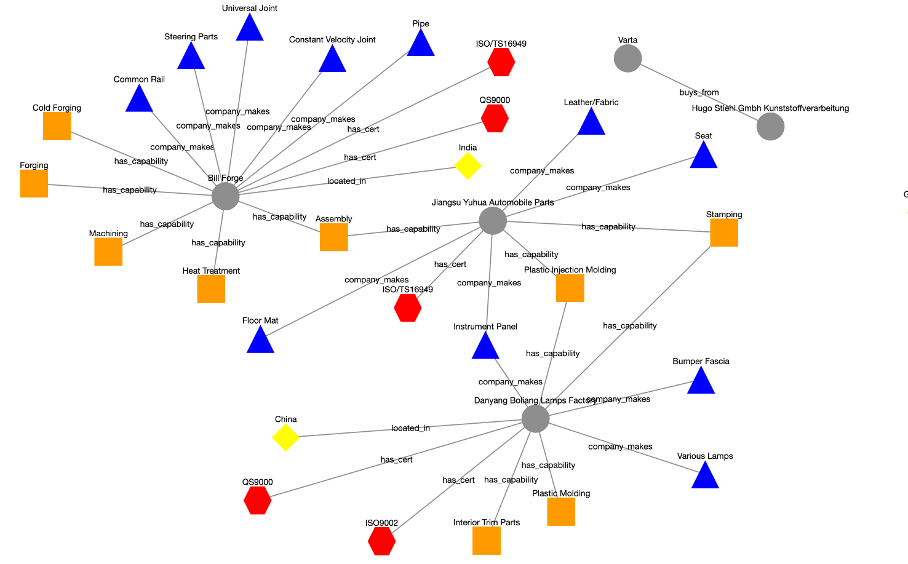

# Link Prediction in Supply Chain Networks

Repo containing MPhil thesis code for link prediction in supply chain knowledge graphs using Graph Representation Learning.


## Getting started
You can get started with recreating the GNN analysis by running
`pip install -r requirements.txt`

The file structure is laid out as follows:

```
|---- config              <- Project configurations
    |-- config.yml        <- For changing run paramteres (e.g. number of epochs 🌝)
|
|---- data
    |-- 01_raw            <- Data from third party sources.
    |-- 02_intermediate   <- Intermediate data that has been transformed.
    |-- 03_models         <- Saved GNN models 
    |-- 04_results        <- Results from the analysis 🚀
|
|---- src
    |-- exploration       <- Exploring the underlying data (e.g. degree distributions)
    |-- ingestion         <- Transforming the complex network into a Knowledge Graph and build Pytorch dataloaders
    |-- managers          <- Training and testing managers for pytorch (`training.py` and `testing.py`)
    |-- model             <- DGL Models
|
|---- README.md           <- The top-level README
```

## Supply Chain Networks as Knowledge Graphs
Modern supply chains lend themselves to a KG representation based on rich metadata regarding their 
certifications, location, buying and selling relationships, and capabilities. A KG representation allows for
companies to interrogate their supply chains in a novel way. Examples including finding alternative suppliers, building relationships
(or removing relationships in nefarious instances). The following image is an extrac of 
the KG built for an automotive suppply chain.  



The ontology of the graph is given as:

Nodes | Number
------------ | -------------
company (e.g. General Motors)| 119,599
product (e.g. Floor mat) | 119,618
capability (e.g. Machining) | 36
certification (e.g. ISO9001) | 9'

Edges in the ontology

Edges | Number
------------ | -------------
('capability', 'capability_produces', 'product') | 21,857
('company', 'buys_from', 'company') | 88997
('company', 'has_capability', 'capability') |  83,787
('company', 'has_cert', 'certification') | 32,654
('company', 'located_in', 'country') | 40,421
('company', 'makes_product', 'product')| 119,618
('product', 'complimentary_product_to', 'product') | 260,658


## Relational Graph Neural Networks (GraphSAGE)
TODO: Topics to mention:
- Inductive vs transductive learning
- Graph Neural Networks for large scale KG Completion
- 

